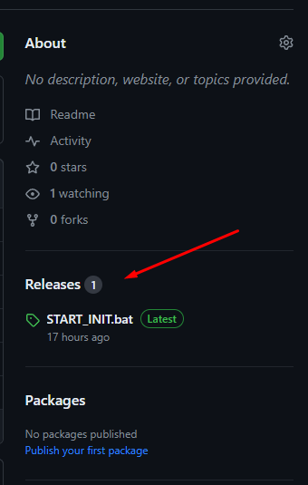
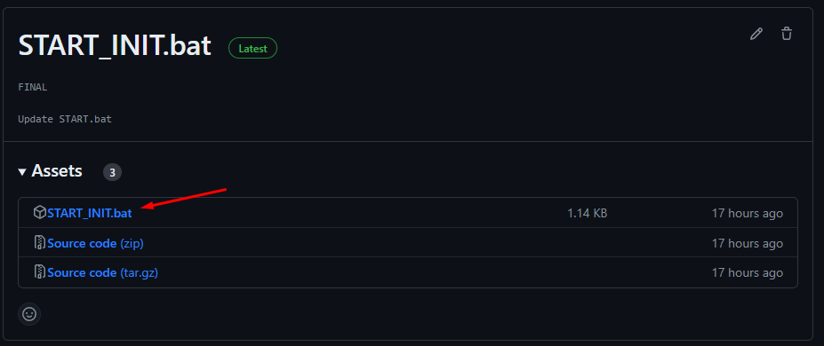
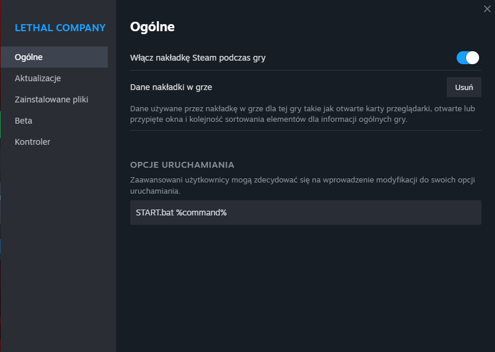

# PaczkaDoLethala

1. Zainstaluj [Git](https://github.com/git-for-windows/git/releases/download/v2.43.0.windows.1/Git-2.43.0-64-bit.exe)
   - Podczas instalacji klikaj Next aż zainstalujesz
2. Wejdź do folderu z Lethal Company
3. Usuń folder **BepInEx**, plik **doorstop_config.ini** i plik **winhttp.dll** jeżeli istnieją
4. Pobierz **START_INIT.bat** z Releases na Githubie

 

5. Wrzuć **START_INIT.bat** do folderu Lethal Company
6. Włącz **START_INIT.bat**
   - Folder **BepInEx**, plik **doorstop_config.ini** i plik **winhttp.dll** powinny zostać pobrane
7. Po wszystkim możesz usunąć **START_INIT.bat** (i od tego momentu używać **START.bat** gdy chcesz zakutalizować paczkę)
8. Kliknij prawym przyciskiem na Lethal Company na Steam i wejdź w właściwości
9. Dodaj `START.bat %command%` do opcji uruchamiania

